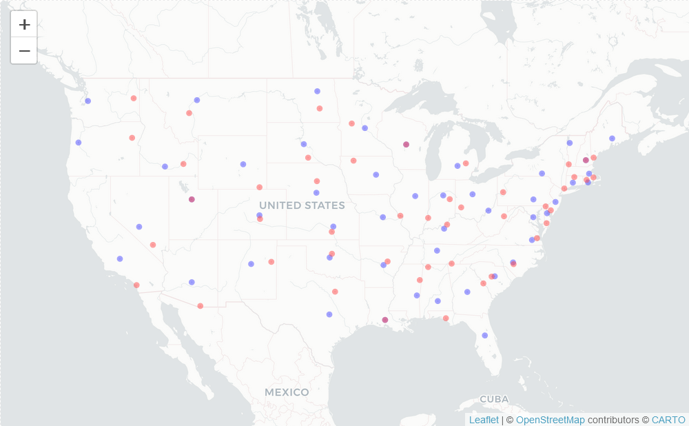
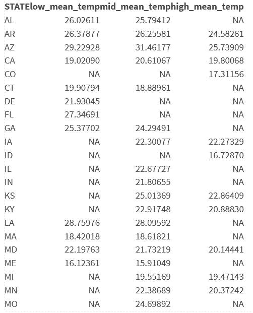

Lab 05 - Data Wrangling
================

# Learning goals

- Use the `merge()` function to join two datasets.
- Deal with missings and impute data.
- Identify relevant observations using `quantile()`.
- Practice your GitHub skills.

# Lab description

For this lab we will be dealing with the meteorological dataset `met`.
In this case, we will use `data.table` to answer some questions
regarding the `met` dataset, while at the same time practice your
Git+GitHub skills for this project.

This markdown document should be rendered using `github_document`
document.

# Part 1: Setup a Git project and the GitHub repository

1.  Go to wherever you are planning to store the data on your computer,
    and create a folder for this project

2.  In that folder, save [this
    template](https://github.com/JSC370/JSC370-2024/blob/main/labs/lab05/lab05-wrangling-gam.Rmd)
    as “README.Rmd”. This will be the markdown file where all the magic
    will happen.

3.  Go to your GitHub account and create a new repository of the same
    name that your local folder has, e.g., “JSC370-labs”.

4.  Initialize the Git project, add the “README.Rmd” file, and make your
    first commit.

5.  Add the repo you just created on GitHub.com to the list of remotes,
    and push your commit to origin while setting the upstream.

Most of the steps can be done using command line:

``` sh
# Step 1
cd ~/Documents
mkdir JSC370-labs
cd JSC370-labs

# Step 2
wget https://raw.githubusercontent.com/JSC370/JSC370-2024/main/labs/lab05/lab05-wrangling-gam.Rmd
mv lab05-wrangling-gam.Rmd README.Rmd
# if wget is not available,
curl https://raw.githubusercontent.com/JSC370/JSC370-2024/main/labs/lab05/lab05-wrangling-gam.Rmd --output README.Rmd

# Step 3
# Happens on github

# Step 4
git init
git add README.Rmd
git commit -m "First commit"

# Step 5
git remote add origin git@github.com:[username]/JSC370-labs
git push -u origin master
```

You can also complete the steps in R (replace with your paths/username
when needed)

``` r
# Step 1
setwd("~/Documents")
dir.create("JSC370-labs")
setwd("JSC370-labs")

# Step 2
download.file(
  "https://raw.githubusercontent.com/JSC370/JSC370-2024/main/labs/lab05/lab05-wrangling-gam.Rmd",
  destfile = "README.Rmd"
  )

# Step 3: Happens on Github

# Step 4
system("git init && git add README.Rmd")
system('git commit -m "First commit"')

# Step 5
system("git remote add origin git@github.com:[username]/JSC370-labs")
system("git push -u origin master")
```

Once you are done setting up the project, you can now start working with
the MET data.

## Setup in R

1.  Load the `data.table` (and the `dtplyr` and `dplyr` packages),
    `mgcv`, `ggplot2`, `leaflet`, `kableExtra`.

``` r
# rm(list=ls())
install.packages('R.utils')
library(data.table)
library(dtplyr)
library(dplyr)
library(mgcv)
library(ggplot2)
library(leaflet)
library(kableExtra)
```

2.  Load the met data from
    <https://github.com/JSC370/JSC370-2024/main/data/met_all_2023.gz> or
    (Use
    <https://raw.githubusercontent.com/JSC370/JSC370-2024/main/data/met_all_2023.gz>
    to download programmatically), and also the station data. For the
    latter, you can use the code we used during lecture to pre-process
    the stations data:

``` r
fn <- "https://raw.githubusercontent.com/JSC370/JSC370-2024/main/data/met_all_2023.gz"
if (!file.exists("met_all_2023.gz"))
  download.file(fn, destfile = "met_all_2023.gz")
met <- data.table::fread("met_all_2023.gz")

met$lat <- met$lat/1000
met$lon <- met$lon/1000
met$wind.sp <- met$wind.sp/10
met$temp <- met$temp/10
met$dew.point <- met$dew.point/10
met$atm.press <- met$atm.press/10
met$rh <- 100*((112-0.1*met$temp+met$dew.point)/(112+0.9*met$temp))^8
met <- na.omit(met)
```

``` r
# Download the data
stations <- fread("ftp://ftp.ncdc.noaa.gov/pub/data/noaa/isd-history.csv")
stations[, USAF := as.integer(USAF)]

# Dealing with NAs and 999999
stations[, USAF   := fifelse(USAF == 999999, NA_integer_, USAF)]
stations[, CTRY   := fifelse(CTRY == "", NA_character_, CTRY)]
stations[, STATE  := fifelse(STATE == "", NA_character_, STATE)]

# Selecting the three relevant columns, and keeping unique records
stations <- unique(stations[, list(USAF, CTRY, STATE, LAT, LON)])

# Dropping NAs
stations <- stations[!is.na(USAF)]

# Removing duplicates
stations[, n := 1:.N, by = .(USAF)]
stations <- stations[n == 1,][, n := NULL]
```

3.  Merge the data as we did during the lecture. Use the `merge()` code
    and you can also try the tidy way with `left_join()`

``` r
met_2 <- merge(
  # Data
  x     = met,
  y     = stations,
  # List of variables to match
  by.x  = "USAFID",
  by.y  = "USAF",
  # Which obs to keep?
  all.x = TRUE,
  all.y = FALSE
  )
```

## Question 1: Identifying Representative Stations

Across all weather stations, which stations have the median values of
temperature, wind speed, and atmospheric pressure? Using the
`quantile()` function, identify these three stations. Do they coincide?

``` r
quantile(met_2$temp, na.rm=TRUE)["50%"]
```

    ##  50% 
    ## 22.2

``` r
quantile(met_2$wind.sp, na.rm=TRUE)["50%"]
```

    ## 50% 
    ## 3.6

``` r
quantile(met_2$atm.press, na.rm=TRUE)["50%"]
```

    ##    50% 
    ## 1011.5

Next identify the stations have these median values.

``` r
station_med <- met_2[, .(
  temp_ID=quantile(temp, probs=.5,na.rm=TRUE),
  wind.sp_ID=quantile(wind.sp, probs=.5,na.rm=TRUE),
  atm.press_ID=quantile(atm.press, probs=.5,na.rm=TRUE),
  lat=quantile(lat, probs=.5,na.rm=TRUE),
  lon=quantile(lon,probs=.5,na.rm=TRUE)
), by=list(USAFID,STATE)]

station_med[, temp_dist:=abs(temp_ID-21.7)]
median_temp_stations <- station_med[temp_dist==0]

station_med[, wind.sp_dist:=abs(wind.sp_ID-3.1)]
median_wind.sp_stations <- station_med[wind.sp_dist==0]

station_med[, atm.press_dist:=abs(atm.press_ID-1011.7)]
median_atm.press_stations <- station_med[atm.press_dist==0]

station_med[atm.press_dist== 0 & wind.sp_dist==0 & temp_dist==0]
```

    ##    USAFID STATE temp_ID wind.sp_ID atm.press_ID    lat     lon temp_dist
    ## 1: 720379    KY    21.7        3.1       1011.7 36.855 -84.856         0
    ##    wind.sp_dist atm.press_dist
    ## 1:            0              0

**The station with USAFID 723119 has all three median values (or have
values closest to them).**

Knit the document, commit your changes, and save it on GitHub. Don’t
forget to add `README.md` to the tree, the first time you render it.

## Question 2: Identifying Representative Stations per State

Now let’s find the weather stations by state with closest temperature
and wind speed based on the euclidean distance from these medians.

``` r
euc <- function(a, b, c, d) sqrt((a - b)^2 + (c - d)^2)

station_med_state <- met_2[, .(
  temp_ID_state=quantile(temp, probs=.5,na.rm=TRUE),
  wind.sp_ID_state=quantile(wind.sp, probs=.5,na.rm=TRUE),
  atm.press_ID_state=quantile(atm.press, probs=.5,na.rm=TRUE)
), by=STATE]

merged <- merge(
  x     = station_med,
  y     = station_med_state,
  by.x  = "STATE",
  by.y  = "STATE",
  all.x = TRUE,
  all.y = TRUE
)

merged[, dist:=euc(temp_ID, temp_ID_state, wind.sp_ID, wind.sp_ID_state)]
median_euc_stations <- merged[ , .SD[which.min(dist)], by = STATE]

median_euc_stations[, c("STATE", "USAFID")]
```

    ##     STATE USAFID
    ##  1:    AL 723235
    ##  2:    AR 722188
    ##  3:    AZ 722728
    ##  4:    CA 722934
    ##  5:    CO 724680
    ##  6:    CT 725080
    ##  7:    DE 724180
    ##  8:    FL 720735
    ##  9:    GA 722180
    ## 10:    IA 726500
    ## 11:    ID 725780
    ## 12:    IL 725342
    ## 13:    IN 725336
    ## 14:    KS 724500
    ## 15:    KY 724235
    ## 16:    LA 722405
    ## 17:    MA 725064
    ## 18:    MD 723980
    ## 19:    ME 726064
    ## 20:    MI 726370
    ## 21:    MN 726557
    ## 22:    MO 724347
    ## 23:    MS 723306
    ## 24:    MT 727720
    ## 25:    NC 723035
    ## 26:    ND 727535
    ## 27:    NE 725524
    ## 28:    NH 726050
    ## 29:    NJ 724075
    ## 30:    NM 723676
    ## 31:    NV 746141
    ## 32:    NY 725037
    ## 33:    OH 724276
    ## 34:    OK 723537
    ## 35:    OR 726886
    ## 36:    PA 725124
    ## 37:    RI 725070
    ## 38:    SC 723100
    ## 39:    SD 726518
    ## 40:    TN 723240
    ## 41:    TX 722479
    ## 42:    UT 725724
    ## 43:    VA 723086
    ## 44:    VT 726166
    ## 45:    WA 727855
    ## 46:    WI 726452
    ## 47:    WV 724170
    ## 48:    WY 725640
    ##     STATE USAFID

**Shown about are the representative stations per state according to the
smallest Euclidean distance between their median temperature and wind
speed and the state medians.**

Knit the doc and save it on GitHub.

## Question 3: In the Geographic Center?

For each state, identify which station is closest to the geographic
mid-point (median) of the state. Combining these with the stations you
identified in the previous question, use `leaflet()` to visualize all
~100 points in the same figure, applying different colors for the
geographic median and the temperature and wind speed median.

``` r
station_med_2 <- met_2[, .(
  lat_med=quantile(lat, probs=.5,na.rm=TRUE),
  lon_med=quantile(lon, probs=.5,na.rm=TRUE)
), by=STATE]

merged_2 <- merge(
  x=met_2[, c("USAFID", "STATE", "lat", "lon")],
  y=station_med_2,
  by.x="STATE",
  by.y="STATE",
  all.x=TRUE,all.y=TRUE
)

merged_2[, temp_dist:=sqrt((lat-lat_med)^2+(lon-lon_med)^2)]
median_coor_stations <- merged_2[ , .SD[which.min(temp_dist)], by = STATE]
```

``` r
m <- leaflet() %>% addProviderTiles(providers$CartoDB.Positron) %>% 
  addCircles(lng=median_coor_stations$lon, lat=median_coor_stations$lat, color="blue") %>% 
  addCircles(lng=median_euc_stations$lon, lat=median_euc_stations$lat, color="red")
```

<figure>

<figcaption aria-hidden="true">Question 3 Map.</figcaption>
</figure>

Knit the doc and save it on GitHub.

## Question 4: Summary Table with `kableExtra`

Generate a summary table using `kable` where the rows are each state and
the columns represent average temperature broken down by low, median,
and high elevation stations.

Use the following breakdown for elevation:

- Low: elev \< 93
- Mid: elev \>= 93 and elev \< 401
- High: elev \>= 401

``` r
met_2 <- met_2 %>% 
  mutate(elev_cat = case_when(elev < 93 ~ "Low",
                              elev >= 93 & elev < 401 ~ "Mid",
                              elev >= 401 ~ "High"))

low_mean_temp <- met_2 %>% 
  filter(elev_cat == "Low") %>% 
  group_by(STATE) %>% 
  summarize(low_mean_temp = mean(temp))

mid_mean_temp <- met_2 %>% 
  filter(elev_cat == "Mid") %>% 
  group_by(STATE) %>% 
  summarize(mid_mean_temp = mean(temp))

high_mean_temp <- met_2 %>% 
  filter(elev_cat == "High") %>% 
  group_by(STATE) %>% 
  summarize(high_mean_temp = mean(temp))

merged_3 <- merge(x=low_mean_temp,y=mid_mean_temp,by="STATE", all=TRUE)
merged_3 <- merge(x=merged_3,y=high_mean_temp,by="STATE", all=TRUE)
# merged_3 %>% kbl()
```

<figure>

<figcaption aria-hidden="true">Question 4 Table.</figcaption>
</figure>

Knit the document, commit your changes, and push them to GitHub.

## Question 5: Advanced Regression

Let’s practice running regression models with smooth functions on X. We
need the `mgcv` package and `gam()` function to do this.

- using your data with the median values per station, first create a
  lazy table. Filter out values of atmospheric pressure outside of the
  range 1000 to 1020. Examine the association between temperature (y)
  and atmospheric pressure (x). Create a scatterplot of the two
  variables using ggplot2. Add both a linear regression line and a
  smooth line.

- fit both a linear model and a spline model (use `gam()` with a cubic
  regression spline on wind speed). Summarize and plot the results from
  the models and interpret which model is the best fit and why.

``` r
med_ldt <- lazy_dt(station_med, immutable=FALSE) %>% 
  filter(atm.press_ID >= 1000 & atm.press_ID <= 1020) %>% 
  collect()

ggplot(med_ldt, aes(x=atm.press_ID, y=temp_ID)) + 
  geom_point(show_guide = FALSE) + 
  geom_smooth(method='lm') + 
  geom_smooth(method = loess, aes(color="red")) + 
  labs(x="Atmospheric pressure",
       y="Temperature", 
       title="The association between temperature and atmospheric pressure") +
  guides(color="none") +
  theme_minimal()
```

<!-- -->

``` r
fit1 <- lm(data=med_ldt, temp_ID ~ wind.sp_ID)
summary(fit1)
```

    ## 
    ## Call:
    ## lm(formula = temp_ID ~ wind.sp_ID, data = med_ldt)
    ## 
    ## Residuals:
    ##      Min       1Q   Median       3Q      Max 
    ## -11.0281  -3.2565  -0.2112   3.6300  11.0881 
    ## 
    ## Coefficients:
    ##             Estimate Std. Error t value Pr(>|t|)    
    ## (Intercept)  20.0278     0.6777  29.552  < 2e-16 ***
    ## wind.sp_ID    0.5162     0.1931   2.674  0.00762 ** 
    ## ---
    ## Signif. codes:  0 '***' 0.001 '**' 0.01 '*' 0.05 '.' 0.1 ' ' 1
    ## 
    ## Residual standard error: 4.423 on 1056 degrees of freedom
    ## Multiple R-squared:  0.006724,   Adjusted R-squared:  0.005783 
    ## F-statistic: 7.148 on 1 and 1056 DF,  p-value: 0.00762

``` r
plot(data=med_ldt, temp_ID ~ wind.sp_ID)
abline(fit1)
```

<!-- -->

``` r
fit2 <- gam(temp_ID ~ s(wind.sp_ID, bs="cr", k=4), data=med_ldt)
summary(fit2)
```

    ## 
    ## Family: gaussian 
    ## Link function: identity 
    ## 
    ## Formula:
    ## temp_ID ~ s(wind.sp_ID, bs = "cr", k = 4)
    ## 
    ## Parametric coefficients:
    ##             Estimate Std. Error t value Pr(>|t|)    
    ## (Intercept)  21.8028     0.1347   161.9   <2e-16 ***
    ## ---
    ## Signif. codes:  0 '***' 0.001 '**' 0.01 '*' 0.05 '.' 0.1 ' ' 1
    ## 
    ## Approximate significance of smooth terms:
    ##                edf Ref.df     F  p-value    
    ## s(wind.sp_ID) 2.93  2.997 9.562 3.95e-06 ***
    ## ---
    ## Signif. codes:  0 '***' 0.001 '**' 0.01 '*' 0.05 '.' 0.1 ' ' 1
    ## 
    ## R-sq.(adj) =  0.0245   Deviance explained = 2.72%
    ## GCV = 19.263  Scale est. = 19.191    n = 1058

``` r
plot(fit2)
```

<!-- -->

**The GAM model is the better fit, since its adjusted R squared value
(0.0245), while low, is better than that of the linear model (0.005783).
I graphed the cubic regression GAM with 4 knots and while it fits the
points poorly, it manages to capture some of the vertical patterns in
the points.**

## Deliverables

- .Rmd file (this file)

- link to the .md file (with all outputs) in your GitHub repository
